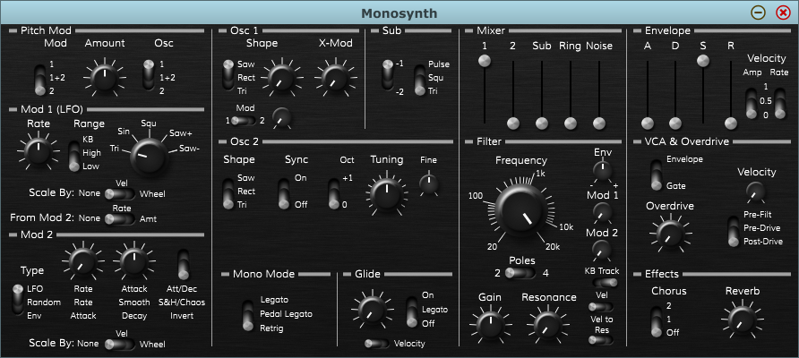

# Joeltronics Monosynth

*name likely to change*

Inspired by analog synths such as:

* Moog Prodigy, Rogue, MG-1, and Sub Phatty
* Arturia Microbrute/Minibrute
* Sequential Pro-One
* Arp Odyssey

Besides sound quality, the main goal is for this to be super accessible and easy to get a good sound out of - much like many classic analog monosynths. Of course, I also don't want it to only have 1 or 2 good sounds with no variation, so the aim is a good tradeoff between accessibility and versatility. One thing's for sure: it's not meant to be a powerful "do everything" monster synth (though that might be coming later...).

## Synthesis Features

* 2 Oscillators + sub
* Variable oscillator shape:
  * Pulse width modulation for square wave
  * Similar timbral controls for saw & tri waves
* Analog imperfections:
  * Slight VCO tuning instability
  * Imperfect oscillator waveforms
* Dirtiness:
  * Ring mod
  * Filter overdrive
  * Post-filter distortion
* High quality:
  * Anti-aliased oscillators
  * High-quality filters (without unit delay in the feedback path)
  * Internal oversampling (typically to 176.4 or 192 kHz)

## Status

The core features are all implemented, and most quality features are in place although there's still room for some improvements. But several parts aren't implemented yet and their GUI controls won't do anything. It could also use a lot of optimization, both in terms of CPU and in reducing a lot of unnecessary memory allocation. The filter algorithm needs a little bit of work too (to fix the volume drop with resonance).

The GUI is not final. All the controls are there, but it could still use a bit of clean-up. I also want to add some visual aids you wouldn't see on a real hardware synth, like an "arc" on the various knobs to show how they're being modulated.

Here is what the GUI looks like at the moment: *(click to enlarge)*  

## Plugin features planned for 1.0

* Fully automatable parameters
* "Underneath the panel" controls - I don't want to rely heavily on these, as accessibility is one of my main goals. But I also don't want the front panel to be too cluttered, so there are a few things I have in mind for "page 2". They could almost be treated like mods to a hardware synth, or in some cases even just the types of calibration tweaks you'd get with an analog synth. I don't want these to be completely "under the hood" though - I'm hoping to have some sort of visual indication on the front panel that things have been modified.
* Patch storage/management - I don't expect to have an incredibly complicated patch manager, but I do want to have something. At the very least, it will support DAW-based patch management, but I may have a onboard patch storage as well.

## Possible future features

These are all features I don't plan on implementing for 1.0, but might be interested in adding in the future:

* Sequencer & arpeggiator
* Monophony priority modes besides last-note
* Filter/VCA feedback distortion

I don't plan on adding polyphony/unison - I would rather make a synth designed for it in the first place (again, that might be coming later...).
