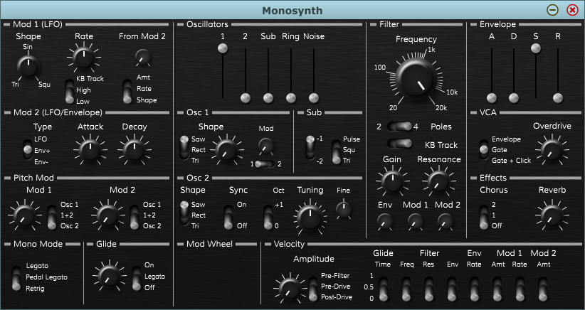

# Joeltronics Monosynth

*name likely to change*

Inspired by analog synths such as:

* Moog Prodigy, Rogue, MG-1, and Sub Phatty
* Arturia Microbrute/Minibrute
* Novation Bass Station 2

The main goal is for this to be super accessible and easy to get a good sound out of. Of course, I also don't want it to only have 1 or 2 good sounds with no variation, so hopefully I can find a good tradeoff between accessibility and versatility. One thing's for sure - it's not meant to be a powerful "do everything" monster synth (though that might be coming next once I'm happy enough with this one to call it 1.0).

## Synthesis Features

* 2 Oscillators + sub
* Variable oscillator shape:
  * Pulse width modulation for square wave
  * Some sort of other similar timbral control for saw & tri waves
* Analog imperfections:
  * Slight tuning instability
  * Imperfect oscillator waveforms
* Dirtiness:
  * Ring mod
  * Filter overdrive
  * Post-filter distortion
* High quality:
  * Anti-aliased oscillators
  * Zero-delay feedback filter(s)
  * Upsampling

## Status

It makes sound. At the moment it just makes an aliased sawtooth wave, but hey, it's something. The GUI controls are pretty much ready to be hooked up, but a lot of the engine features aren't implemented yet.

Although most of the controls are there, the GUI is currently really messy and possibly a bit confusing. I plan on streamlining it eventually - maybe even removing some controls to better fit with my design philosophy. But now that the GUI is in a "good enough for now" state, the next step is to get the sound engine working.

Here is what the GUI looks like at the moment: *(click to enlarge)*  

## Plugin features planned for 1.0

* Fully automatable parameters - so if you want an extra LFO, you could always use automation to act as one
* "Underneath the panel" controls - I don't want to rely heavily on these, as accessibility is one of my main goals. But I also don't want the front panel to be too cluttered, so there are a few things I have in mind for "page 2". They could almost be treated like "mods" to a hardware synth.

## Features not planned for 1.0

These are all features I'm considering possibly adding in the future, but don't plan on implementing right away:

* Built-in patch storage & management - I do plan on supporting state saving and maybe very basic patch management via the DAW, but there won't be a built-in patch manager yet.
* More monophony priority modes (besides last-note)
* Polyphony & unison
* Sequencer & arpeggiator
* Filter feedback distortion - until then, there are 2 other kinds of distortion
